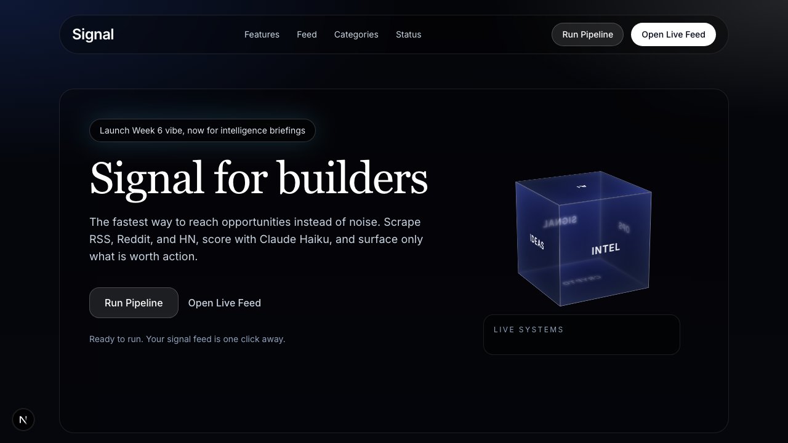
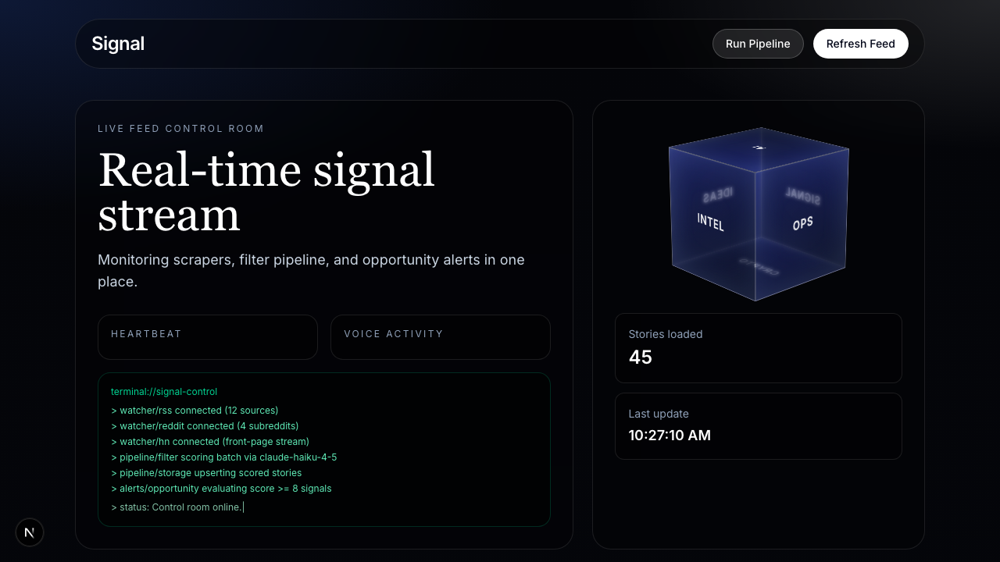

# Signal — Personal AI News Filter

> Cut through the noise. Surface only what's worth acting on.

Signal is a self-hosted, personalized news filtering app. It scrapes RSS feeds, Reddit, and Hacker News daily, then runs every story through Claude Haiku against *your* scoring profile — so your feed surfaces only the high-signal content that matters to you.

**Live demo:** [signal-nu-nine.vercel.app](https://signal-nu-nine.vercel.app)

---

## What It Does

- **Scrapes** 20+ RSS feeds, Reddit subreddits, and Hacker News daily (free, no API keys needed for scraping)
- **Filters** every story through Claude Haiku with your personal scoring profile — not a generic relevance algorithm
- **Surfaces** a ranked feed by category: Opportunities, Ideas, and Intel
- **Notifies** you via Web Push when a high-score story drops
- **Costs ~$0.50–$3/month** to run (you bring your own Anthropic key; Haiku only in the filter pipeline)

---

## Screenshots

| Landing | Feed |
|---------|------|
|  |  |

---

## Architecture

```
[Daily Cron]  →  /api/scrape  →  RSS + Reddit + HN + Nitter
                                       ↓
                              raw_stories (shared pool, Supabase)
                                       ↓
[User: Run Pipeline]  →  decrypt BYOK key  →  Claude Haiku (batch, 24 stories/call)
                                                      ↓
                                          scored_stories (per user_id)
                                                      ↓
                              /feed  →  ranked by score, filtered by category
                                       ↓
                              Web Push  →  high-score alerts
```

**User setup flow:** Sign up → verify email → add Anthropic key in Settings → complete 10-question onboarding (Claude Sonnet synthesizes a scoring profile) → /feed

---

## Tech Stack

| Layer | Technology |
|-------|-----------|
| Frontend / Backend | Next.js 16 (App Router) |
| Database + Auth | Supabase (Postgres + RLS) |
| AI Filtering | Claude Haiku (`claude-haiku-4-5`) — batch scoring only |
| Profile Synthesis | Claude Sonnet — one-shot at onboarding |
| Styling | Tailwind CSS |
| Hosting | Vercel (Hobby tier) |
| Push Notifications | Web Push (VAPID) |

---

## Self-Hosting Guide

### Prerequisites

- [Supabase](https://supabase.com) account (free tier works)
- [Vercel](https://vercel.com) account (Hobby tier works)
- [Anthropic](https://console.anthropic.com) API key (each user brings their own — BYOK)

### 1. Clone and install

```bash
git clone https://github.com/KBKote/signal.git
cd signal
npm install
```

### 2. Set up Supabase

1. Create a new Supabase project
2. Run the full schema in the SQL editor:

```bash
# Copy the contents of supabase/schema.sql and run in Supabase SQL editor
```

3. Apply migrations in order (Supabase SQL editor or `supabase db push`):

```
supabase/migrations/20260411120000_scrape_user_throttle.sql
supabase/migrations/20260411130000_filter_user_throttle.sql
supabase/migrations/20260411140000_api_scored_stories_page.sql
supabase/migrations/20260411150000_prune_signal_story_tables.sql
supabase/migrations/20260412100000_scoring_markdown.sql
supabase/migrations/20260412200000_atomic_rate_limit.sql
supabase/migrations/20260412210000_auth_rate_limit.sql
supabase/migrations/20260422110000_fix_ivfflat_probes.sql
```

4. In Supabase Auth settings:
   - Enable **Email** provider with email + password
   - Set **Site URL** to your production URL
   - Add `/auth/callback` to **Redirect URLs**

### 3. Configure environment variables

```bash
cp .env.local.example .env.local
```

Fill in `.env.local`:

```env
# Required
NEXT_PUBLIC_SUPABASE_URL=https://your-project.supabase.co
NEXT_PUBLIC_SUPABASE_ANON_KEY=eyJ...
SUPABASE_SERVICE_ROLE_KEY=eyJ...

# AES-256-GCM key for encrypting user Anthropic keys at rest
SECRETS_ENCRYPTION_KEY=          # openssl rand -base64 32

# Sonnet model for one-shot profile synthesis at onboarding
ANTHROPIC_PROFILE_MODEL=claude-sonnet-4-6

# Web Push (generate with: npx web-push generate-vapid-keys)
NEXT_PUBLIC_VAPID_PUBLIC_KEY=...
VAPID_PRIVATE_KEY=...
VAPID_SUBJECT=mailto:you@example.com

# Production: protects the /api/scrape cron endpoint
CRON_SECRET=
NEXT_PUBLIC_SITE_URL=https://your-app.vercel.app
```

### 4. Run locally

```bash
npm run dev          # http://localhost:3000
npm run tunnel       # Cloudflare quick tunnel (for OAuth callbacks)
```

### 5. Deploy to Vercel

```bash
vercel deploy
```

Add all environment variables in Vercel's project settings. The daily scrape cron (`vercel.json`) runs automatically at midnight UTC on Vercel Hobby.

---

## Cost Breakdown

Signal is designed to be cheap to run. Each user brings their own Anthropic key (BYOK), so your operator costs are near zero.

| Item | Cost |
|------|------|
| Vercel Hobby | Free |
| Supabase Free tier | Free |
| RSS / Reddit / HN scraping | Free |
| Claude Haiku (per user, per daily run) | ~$0.01–0.05/run |
| Claude Sonnet (one-shot onboarding only) | ~$0.01 one-time |
| **Typical monthly per user** | **< $1.50** |

Haiku costs are kept low by: keyword pre-filtering before any Claude call, batching 24 stories per API call, and capping `why` to 12 words and `summary` to 20 words in the response.

---

## Customizing Your Sources

Edit `lib/scrape-sources.ts` to add or remove:
- **RSS feeds** — any feed URL
- **Subreddits** — just the subreddit name
- **Nitter accounts** — Twitter/X accounts via free Nitter RSS

The scoring profile is generated at onboarding from your answers to 10 questions. Claude Sonnet synthesizes a `scoring_markdown` document that Haiku uses on every filter run. You can view and edit your profile in `/settings`.

---

## Project Structure

```
signal/
├── app/                        # Next.js App Router
│   ├── page.tsx                # Landing page
│   ├── feed/                   # Main feed (auth-gated)
│   ├── settings/               # BYOK key + scoring profile editor
│   ├── onboarding/             # 10-question profile setup
│   └── api/
│       ├── scrape/             # Trigger scraper (cron + manual)
│       ├── filter/             # Run Claude Haiku pipeline (user BYOK)
│       ├── stories/            # Fetch scored feed with pagination
│       └── onboarding/         # Synthesize scoring profile (Sonnet)
├── lib/
│   ├── scraper/                # RSS, Reddit, HN, Nitter collectors
│   ├── filter.ts               # Claude Haiku batch scoring pipeline
│   ├── auth/                   # Gate logic (email → BYOK → profile → feed)
│   ├── crypto-user-secrets.ts  # AES-256-GCM encrypt/decrypt for BYOK
│   ├── pipeline-preferences.ts # Scope settings (precise/balanced/expansive)
│   └── scrape-sources.ts       # All RSS feeds, subreddits, Nitter accounts
├── components/                 # React UI components
├── supabase/
│   ├── schema.sql              # Full DB schema + RLS policies
│   └── migrations/             # Incremental SQL migrations
├── proxy.ts                    # Auth routing (replaces Next.js middleware)
├── .env.local.example          # Environment variable template
└── vercel.json                 # Cron schedule (daily scrape)
```

---

## Security Notes

- **BYOK isolation**: Each user's Anthropic key is encrypted at rest with AES-256-GCM using a server-side `SECRETS_ENCRYPTION_KEY`. The key is decrypted only at request time, never logged, and never used as a fallback for other users.
- **Row-Level Security**: All Supabase tables use RLS policies. Users can only read/write their own rows.
- **Gate chain**: Every protected API route enforces session → email verified → BYOK key → scoring profile in order.
- **Rate limiting**: DB-backed atomic rate limits on scrape (per user) and filter (90s cooldown per user).

---

## Known Limitations

- **Vercel Hobby cron**: One cron per day max — scrape runs once at midnight UTC. If you need more frequent scraping, move `/api/scrape` to a separate worker (Railway, Fly.io, or Cloudflare Worker).
- **Pool depletion**: After multiple filter runs in a day, the unscored candidate pool empties. Run the scraper first to replenish.
- **Nitter reliability**: Public Nitter instances are unreliable. `breakdown.nitter === 0` in scrape logs usually means the instance was down, not a code bug.
- **Memory on Vercel**: `next build` may be killed in low-memory environments. The app is known to work fine on standard Vercel deployments.

---

## License

MIT — see [LICENSE](LICENSE).

---

## Contributing

Pull requests are welcome. Before submitting:

```bash
npm run lint   # must pass
npm run build  # must pass
```

For significant changes, open an issue first to discuss the approach. Keep the filter pipeline on Haiku only — Sonnet/Opus would break the cost model for self-hosters.
